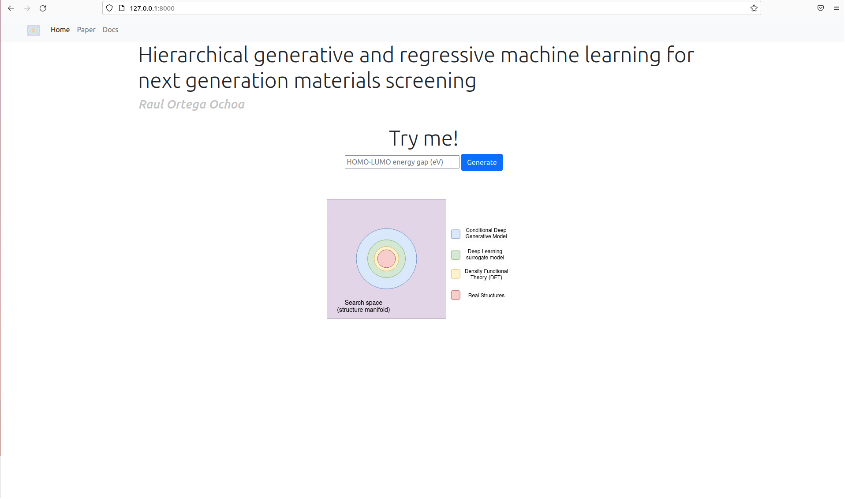

# Web application - Hierarchical generative and regressive machine learning for next generation materials screening

This repository contains the source code for web-application for the paper:

> Ortega, Raul & Benediktsson, Bardi & Sechi, Renata & Jørgensen, Peter & Bhowmik, Arghya. (2023). ["Materials Funnel 2.0 - Data-driven hierarchical search for exploration of vast chemical spaces"](https://chemrxiv.org/engage/chemrxiv/article-details/65130f76ade1178b2429cd68). 10.26434/chemrxiv-2023-s8t6s-v2. 

For the source code of the method implementation https://github.com/raulorteg/hts_funnel



## About
------------------------------
This is a web-application built to serve as an easier way to interact to the method proposed in _["Materials Funnel 2.0 - Data-driven hierarchical search for exploration of vast chemical spaces"](https://chemrxiv.org/engage/chemrxiv/article-details/65130f76ade1178b2429cd68)_ as a web-application.

* For the source code of the method implementation: https://github.com/raulorteg/hts_funnel

## Installation 
------------------------------
1. Clone the repository: ```git clone https://github.com/raulorteg/hts_funnel-app```
2. Create the python virtual environment (I use python 3.9.14): ```virtualenv --py=python3.9 hts_funnel_app```
3. Activate virtualenv  ```source hts_funnel_app/bin/activate```
4. Install requirements ```python -m pip install -r requirements.txt``` Note: Your system might need a different torch installation (https://pytorch.org/get-started/locally/)

## Requirements
------------------------------

see the ```requirements.txt``` file


## Usage
------------------------------

From `/app` launch the web-application by running the command:

```bash
python -m uvicorn main:app --reload
```

Then open `http://127.0.0.1:8000` on the browser to see the web-application.

## Docker
------------------------------

Build the Docker image
```bash
sudo docker build . --tag="funnelapp:latest"
```

Run the docker image
```bash
sudo docker run --rm -it -p 80:80/tcp funnelapp:latest
```

Then open `http://0.0.0.0:80` on the browser to see the web-application.

## Code formatting
Use isort 5.10.1 and black 22.10.0:
```bash
python -m pip install isort==5.10.1 black==22.10.0 
```

Sort the imports:
```bash
python -m isort <file_or_directory>
```


To format:
```bash
python -m black <file_or_directory>
```